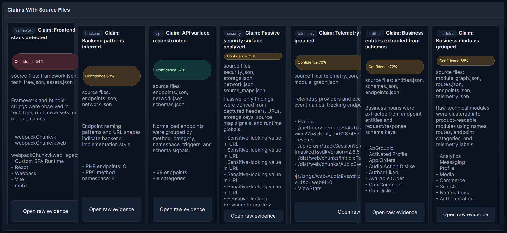
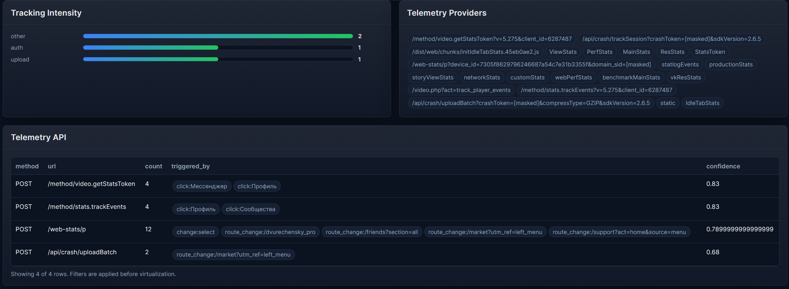
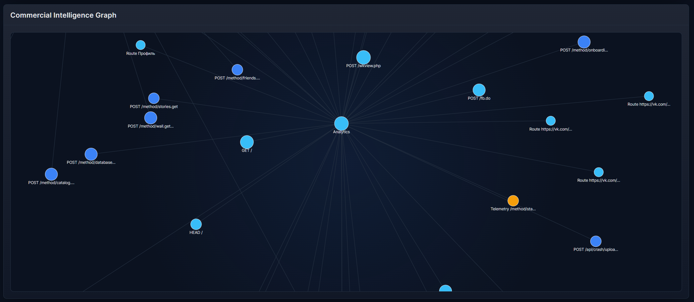
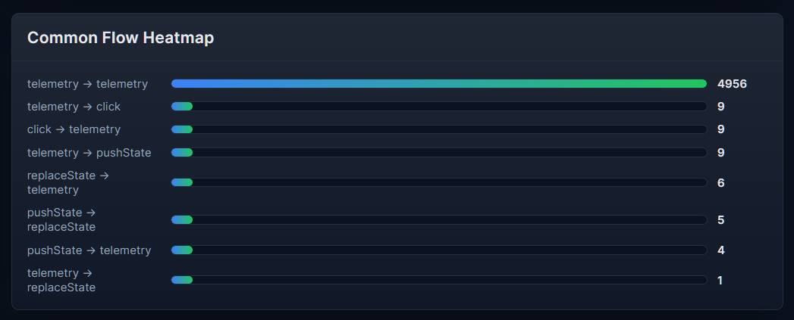

<div align="center" style="margin: 20px 0; padding: 10px; background: #1c1917; border-radius: 10px;">
  <strong>Language:</strong>
  <a href="./README.ru.md" style="color: #F5F752; margin: 0 10px;">Russian</a>
  |
  <span style="color: #0891b2; margin: 0 10px;">English current</span>
</div>

<p align="center">
  
</p>

<h1 align="center">
Browser Reverse Engineering Toolkit
</h1>

<p align="center">
  A three-part toolkit for browser session capture, automated crawling, and offline reconstruction of modern web applications.
</p>

<p align="center">
  
  
  
</p>

<h2 align="center">Overview</h2>

This repository is not about bypassing authentication or attacking websites. It works with what is already available inside a browser session: DOM, network activity, runtime state, storage, routes, telemetry, and the traces of real user interaction.

The monorepo is built around one pipeline:

```text
Capture -> Crawl -> Reconstruct -> Review -> Export
```

<h2 align="center">Example Page</h2>






- https://dvurechensky.github.io/Browser.Reverse.Engineering.Toolkit/

<h2 align="center">Projects</h2>

### `SiteSnapshotter`

Browser-side capture engine injected into a live page through DevTools or browser automation.

- Records DOM, CSS, assets, requests, responses, routes, storage, IndexedDB, Cache Storage, and Service Worker signals.
- Supports session recording via `watch()`.
- Produces JSON capture packages for downstream analysis.

Docs:

- [English README](./SiteSnapshotter/README.md)
- [Russian README](./SiteSnapshotter/README.ru.md)

### `SiteCrawlerSnapshotter`

Playwright orchestration layer for running one continuous browser session against a target site.

- Uses a persistent Chromium profile.
- Supports `auth none|manual|auto|profile`.
- Survives redirects and login flows.
- Discovers internal URLs and records one final session capture.

Docs:

- [English README](./SiteCrawlerSnapshotter/README.md)
- [Russian README](./SiteCrawlerSnapshotter/README.ru.md)

### `SiteReconstructor`

Offline analysis and reporting layer that converts capture packages into structured reports and export artifacts.

- Builds architecture, API, scenario, telemetry, storage, entity, and security views.
- Generates HTML reports, Postman collections, OpenAPI drafts, TypeScript SDK drafts, and MockServers.
- Works with manual captures and crawler sessions.

Docs:

- [English README](./SiteReconstructor/README.md)
- [Russian README](./SiteReconstructor/README.ru.md)

<h2 align="center">Typical Workflow</h2>

1. Capture a browser session manually with `SiteSnapshotter` or automatically with `SiteCrawlerSnapshotter`.
2. Feed the resulting capture folder into `SiteReconstructor`.
3. Review the generated HTML portal and exported artifacts.
4. Use the result as engineering intelligence, integration prep, migration support, or technical due diligence input.

<h2 align="center">Who This Is For</h2>

- reverse engineers
- integration teams
- frontend and platform engineers
- security-minded analysts
- migration and due-diligence teams

<h2 align="center">Repository Layout</h2>

```text
SiteSnapshotter/         browser capture engine
SiteCrawlerSnapshotter/  Playwright automation and session crawling
SiteReconstructor/       offline report and export pipeline
scripts/                 auxiliary build and generation scripts
docs/                    internal notes and working materials
```

<h2 align="center">Current Position</h2>

As an open-source engineering toolkit, this repository is already meaningful. It has real depth in session capture, browser-state analysis, IndexedDB intelligence, and reconstruction of technical artifacts.

As a commercial out-of-the-box platform, it is not there yet. The main gaps are product polish, repeatability of categorization, and the trust level required for generated exports such as SDKs and mock servers.

The practical sweet spot today is:

- strong open-core toolkit
- expert-led paid analysis
- niche B2B/internal platform potential

<h2 align="center">License</h2>

This repository is distributed under the [MIT License](./LICENSE).
